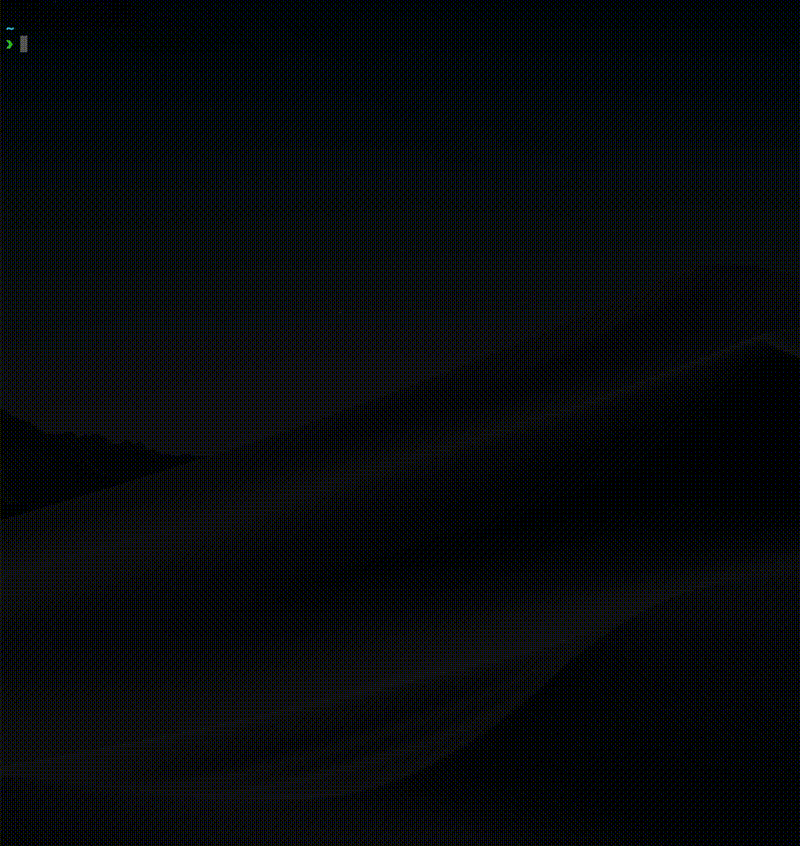

# fish shell でお誕生日をお祝いしましょう




## 使い方

birthday.fishを``function``ディレクトリに作成します。

```sh
> ~/.config/fish/functions/birthday.fish
```

``birthday <名前>``となるように、コマンドを入力しましょう。

```sh
> birthday Mr.ABE
```

## 注意事項

- 日本語を入力しても動作しません
- 29文字以上入力すると、文字がケーキをはみ出します

## 補足

下記の操作でも、birthday.fishを``function``ディレクトリに作成することができます。

```sh
> git clone https://github.com/Matsuhaya/fish-birthday.git
> cd fish-birthday/
> fish add_functions.fish
```

## AAの出典先
[Asciiworld.com : Birthday](http://www.asciiworld.com/-Birthday-.html)